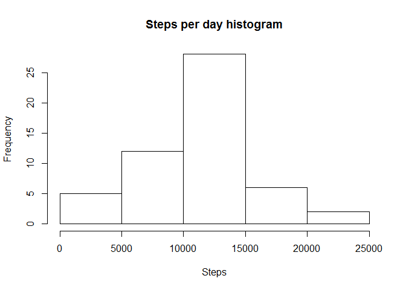
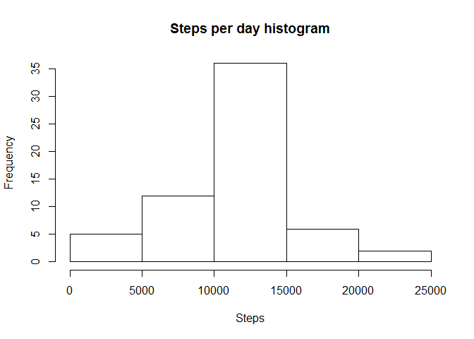
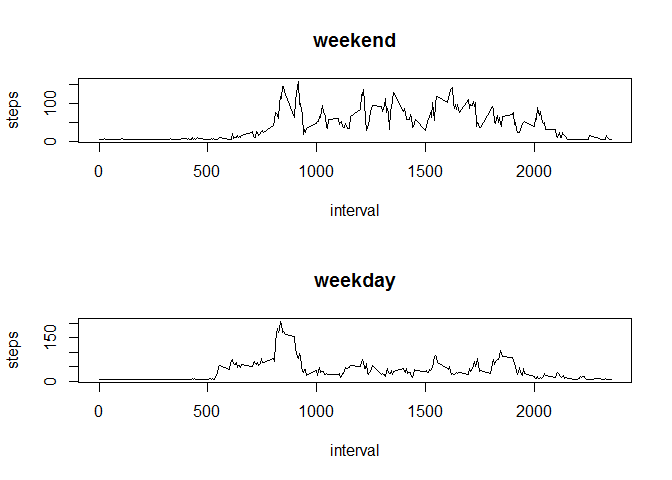

# Reproducible Research: Peer Assessment 1


## Loading and preprocessing the data
Load the data:

```r
data <- read.csv('activity.csv')
```

## What is mean total number of steps taken per day?
Calculate the total number of steps taken per day:

```r
perday <- aggregate(steps ~ date, data = data, FUN = sum)
```

Make a histogram of the total number of steps taken each day:

```r
hist(perday$steps, main = "Steps per day histogram", xlab = "Steps")
```

 

Calculate and report the mean and median of the total number of steps taken per day:

```r
stepsmean <- mean(perday$steps)
stepsmean
```

```
## [1] 10766.19
```

```r
stepsmedian <- median(perday$steps)
stepsmedian
```

```
## [1] 10765
```

## What is the average daily activity pattern?
Make a time series plot (i.e. type = "l") of the 5-minute interval (x-axis) and the average number of steps taken, averaged across all days (y-axis):

```r
interval <- aggregate(steps ~ interval, data = data, FUN = mean)
plot(interval, type = "l")
```

 

Which 5-minute interval, on average across all the days in the dataset, contains the maximum number of steps?

```r
interval[which.max(interval$steps),'interval']
```

```
## [1] 835
```

## Imputing missing values
Calculate and report the total number of missing values in the dataset (i.e. the total number of rows with NAs):

```r
sum(is.na(data))
```

```
## [1] 2304
```

My filling strategy is all NA is 42. Create a new dataset that is equal to the original dataset but with the missing data filled in:

```r
new_data <- data
new_data$steps[is.na(new_data$steps)] <- 42
```

Make a histogram of the total number of steps taken each day:

```r
perday <- aggregate(steps ~ date, data = new_data, FUN = sum)
hist(perday$steps, main = "Steps per day histogram", xlab = "Steps")
```

 

Calculate and report the mean and median of the total number of steps taken per day:

```r
newstepsmean <- mean(perday$steps)
newstepsmean
```

```
## [1] 10940.59
```

```r
newstepsmedian <- median(perday$steps)
newstepsmedian
```

```
## [1] 11458
```

The mean increase on 174.4014847, median - 693

## Are there differences in activity patterns between weekdays and weekends?
Create a new factor variable in the dataset with two levels – “weekday” and “weekend” indicating whether a given date is a weekday or weekend day:

```r
daytype <- function(date) {
    if (weekdays(as.Date(date)) %in% c("суббота", "воскресенье")) {
        "weekend"
    } else {
        "weekday"
    }
}
new_data$daytype <- as.factor(sapply(new_data$date, daytype))
```

Make a panel plot containing a time series plot (i.e. type = "l") of the 5-minute interval (x-axis) and the average number of steps taken, averaged across all weekday days or weekend days (y-axis):

```r
par(mfrow = c(2, 1))
for (type in c("weekend", "weekday")) {
    steps.type <- aggregate(steps ~ interval, data = new_data, subset = new_data$daytype == 
        type, FUN = mean)
    plot(steps.type, type = "l", main = type)
}
```

 
